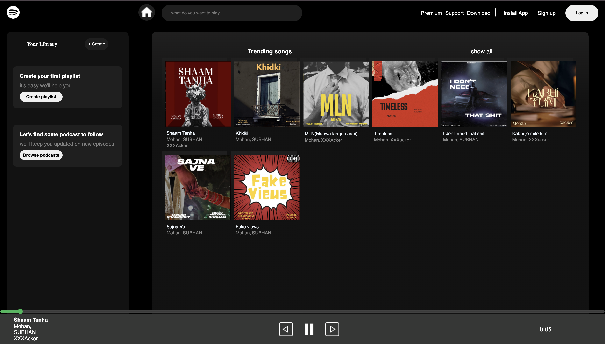

# Spotify Clone

A responsive front-end clone of Spotify's web player, built from scratch using HTML, CSS, and vanilla JavaScript.

## 🚀 Live Demo

[Add your deployed link here once it's live]

## 📸 Preview




## ✨ Features

- Responsive layout that adapts across desktop, tablet, and mobile screens using Flexbox
- Custom-styled song and artist cards with circular artist images
- Play / pause functionality powered by a shared JavaScript `Audio` object, so only one track plays at a time
- Dynamic song data fetched using the Fetch API instead of being hardcoded into the HTML
- Clean, dark-themed UI inspired by Spotify's design language

## 🛠️ Built With

- **HTML5** – structure and markup
- **CSS3** – Flexbox layout, responsive design, custom styling
- **JavaScript (Vanilla)** – DOM manipulation, Fetch API, audio playback logic

## 📂 Project Structure

```
spotify-clone/
├── index.html
├── style.css
├── script.js
├── assets/
├── posters/
├── songs/
├── icons/
└── README.md
```

## 🧠 What I Learned

Building this project helped me get hands-on with a few core front-end concepts:

- **Responsive design**: using Flexbox to handle shrinking/wrapping layouts across screen sizes, and fixing common issues like inconsistent card sizing
- **Fetch API**: pulling in song/artist data asynchronously instead of hardcoding it, and rendering it dynamically to the DOM
- **Audio handling in JS**: managing playback state with a single shared `Audio` object so play/pause behaves correctly across multiple song cards

## ⚙️ Getting Started

1. Clone the repo:
   ```bash
   git clone https://github.com/your-username/spotify-clone.git
   ```
2. Open the project folder:
   ```bash
   cd spotify-clone
   ```
3. Open `index.html` in your browser, or run it with a Live Server extension in VS Code.


## 📌 Future Improvements

- Add a working search bar
- Add a playlist creation feature
- Improve accessibility (keyboard controls, ARIA labels)

## 👤 Author

**Mohan**
Frontend Developer | GitHub : https://github.com/newwmohan-jpg | LinkedIn : https://www.linkedin.com/in/mohan-undefined-8a7942416/?skipRedirect=true
